# IntelliJ Tips and Tricks
Hi there, this cheatsheet consists of my most used features in IntelliJ which saves me time during my development hours. I want to share it with the community with the intent that it will maximize your time as well. 

## Key Mappings:
An effective way to minimize your coding time to touch your mouse as infrequently as possible. Learning keyboard shortcuts accomplishes this.

[Keyboard Mapping Cheatsheets for Windows and MacOS](https://resources.jetbrains.com/storage/products/intellij-idea/docs/IntelliJIDEA_ReferenceCard.pdf)

## Text Navigation:
Before we get into IntelliJ specific commands
let's discuss basic text navigation.

### Moving between words
```
Ctrl + →  // Windows
Alt  + →  // MacOS
```
### Moving to the end of lines
```
CMD  + →  // MacOS
```
### Selecting text
```
Ctrl + Shift + →  // Windows
Alt  + Shift + →  // MacOS
```

## IntelliJ Basics:
Now that we've gotten the text navigation basics out of the way, we can jump into the IntelliJ specifics.

### Intellisense
When IntelliJ boots up, it indexes all the files, classes, and jars associated with the project. This allows the tool to provide predictions about
what you want to type.
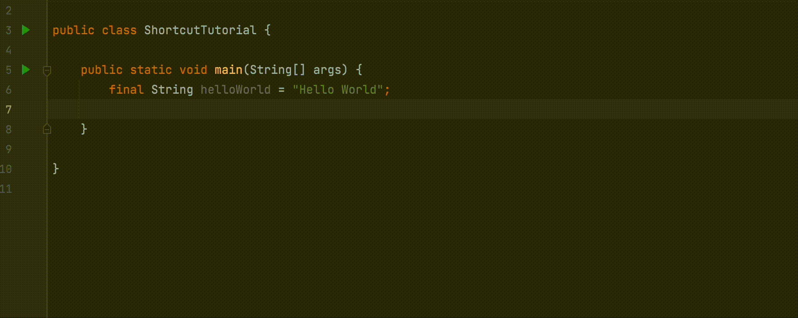

### Smart suggestions
```
Alt + Enter
```
Let Smart suggestions become your best friend while using IntelliJ. Whenever IntelliJ highlights
your code, it's usually warning you that you have a mistake. Let Smart suggestions assist you with correcting this. The suggestion also present you alternative ways to express your code.
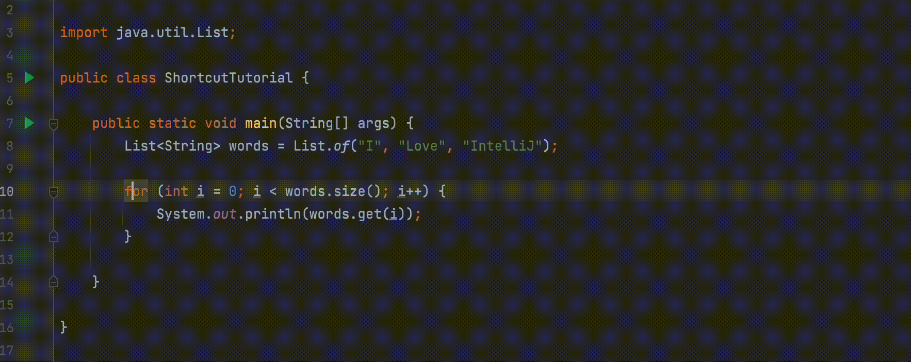


## Moving Code Around
As we're writting code, we'll realize that we want to move the locations of lines and functions. Instead of cut and pasting the code, IntelliJ offer alternative ways of moving it.

### Moving lines
```
Alt + Shift + ↑
Alt + Shift + ↓
```
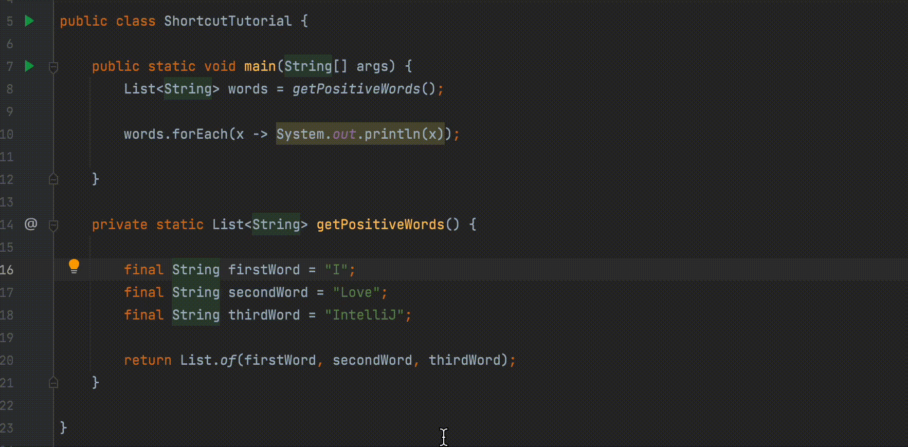

### Moving blocks of code
```
CMD + Shift + ↑
CMD + Shift + ↓
```
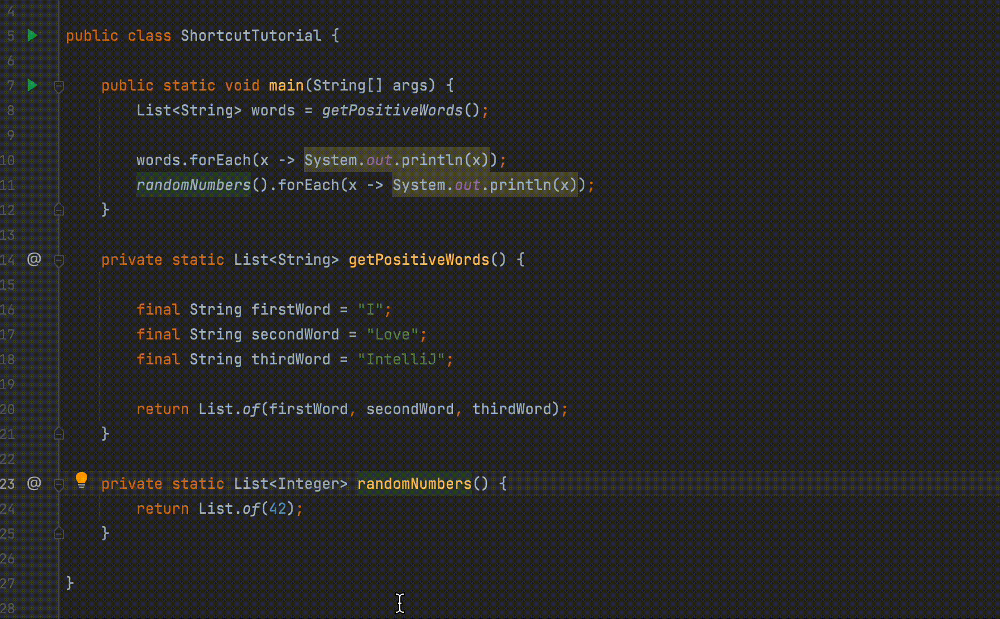

### Line duplication
```
CMD + D
```
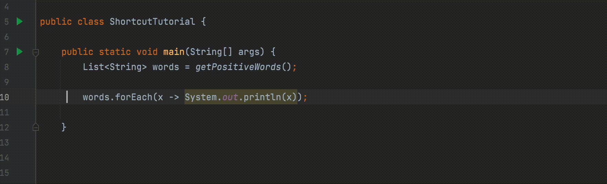

## Navigating the Codebase:
As engineers we spend more time reading code than writing it. Because of this, it's important that we know how to search our codebases to find files, code usages, patterns, and etc.

### Finding files
```
Shift + Shift (Tap the Shift twice)
```
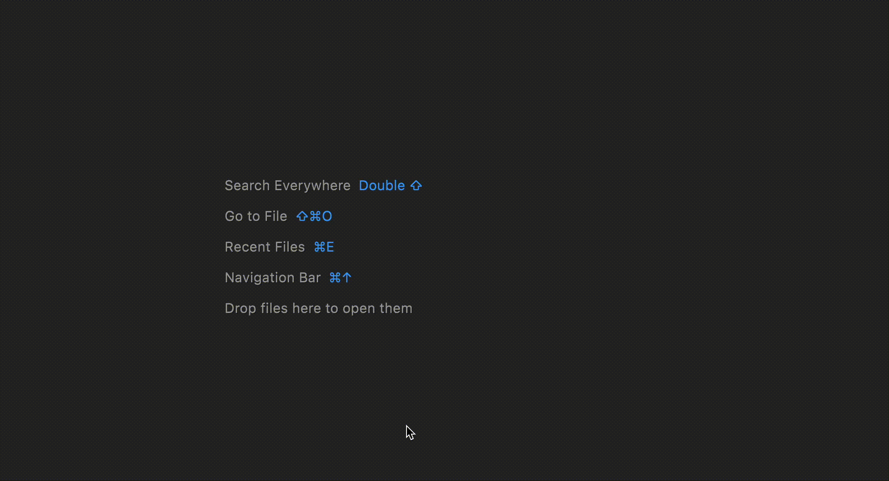

### Finding classes
```
CMD + O
```
You should also know that IntelliJ will find multinamed
classes by searching for their acronym. 

E.g. Searching for "ST" will find "StringToken", "StreamTuple", etc.
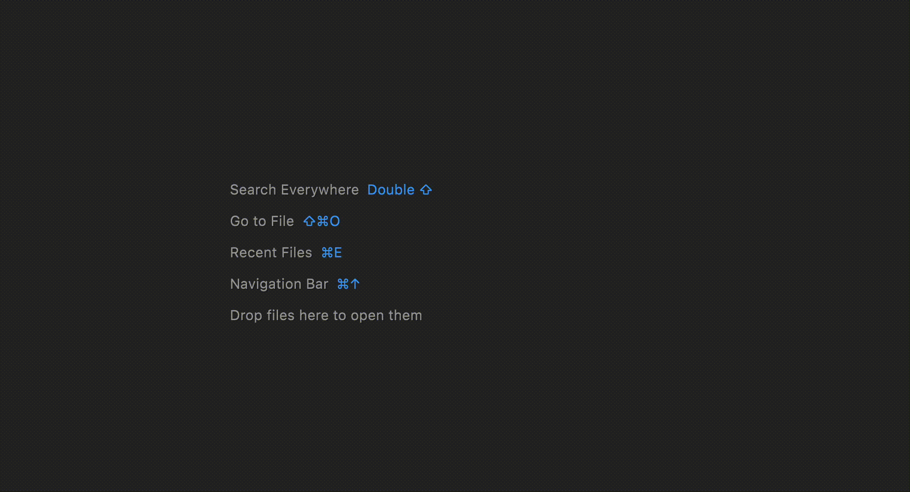

### Find in path/files
```
Right-click on the package > "Find in Files" 
```
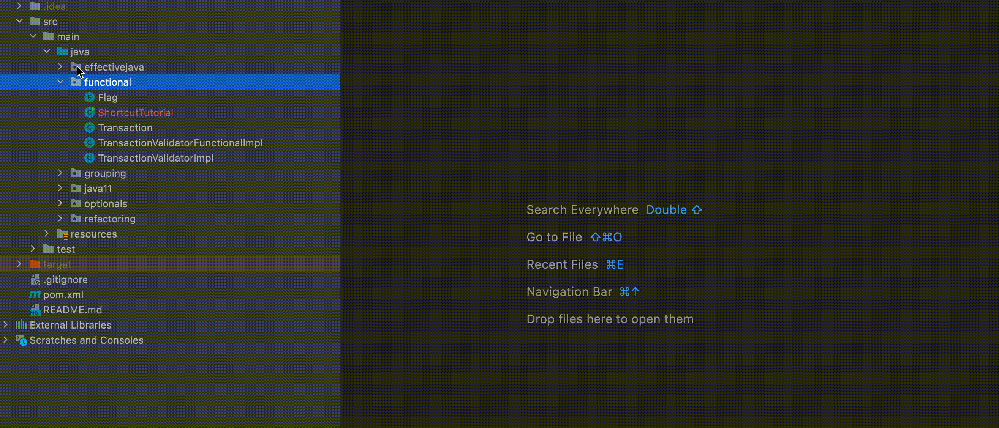

### Find usages
```
Alt + F7
```


### Finding declarations
```
CMD + B
```
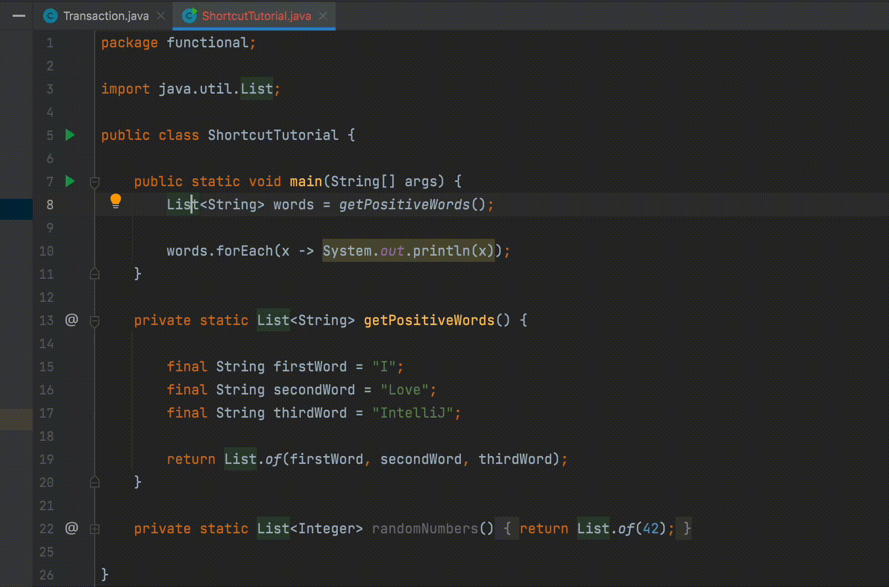

### Going back to the last spot
```
CMD + Alt + ←
```


## Refactoring:
Writing code can be more like an art instead of science. There will be cases where you need to rename variables, refactor methods, and otherwise.

### Renaming
```
Shift + F6
```
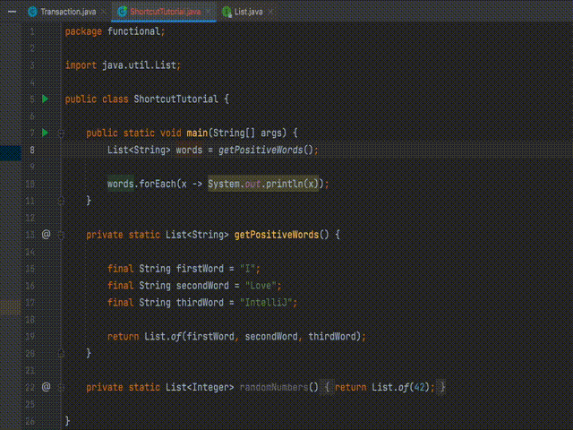

### Extract methods
```
CMD + Alt + M
```
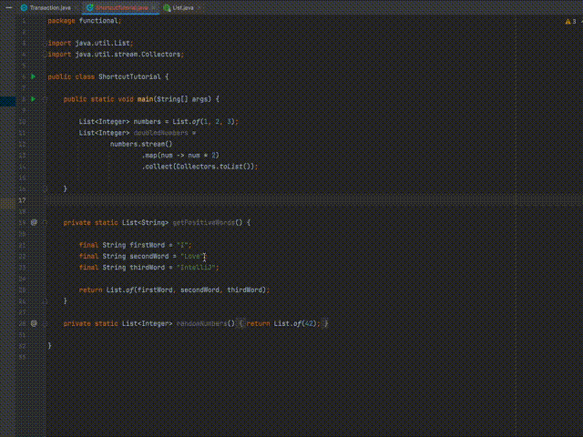

### Introduce variables
```
CMD + Alt + V
```
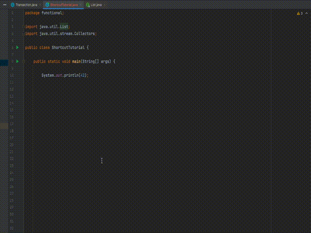

### Inline methods
```
CMD + Alt + N
```
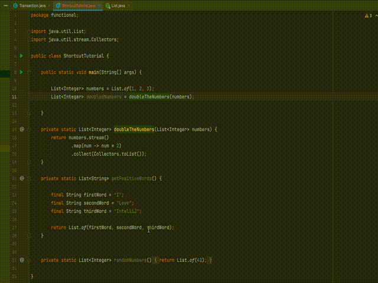

## Debugging:
When we write, we're inevitably going to run into bugs. Being able to use your tools to help you solve the bugs is a crucial skill to have.

### Breakpoints
You can click on the line numbers to add a breakpoint in your code.
Afterwards, when you run the program in debug mode, the code
will stop at that breakpoint.
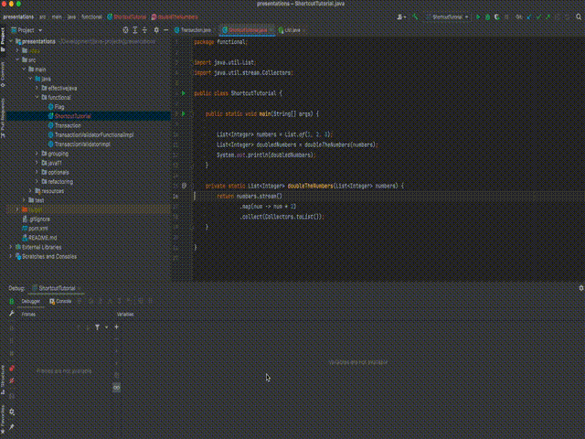

### Evaluator tool
Another useful tool while debugging is the Evaluator tool. It allows you to execute expressions during the runtime of the application. It helps you confirm values as you step through the code. 
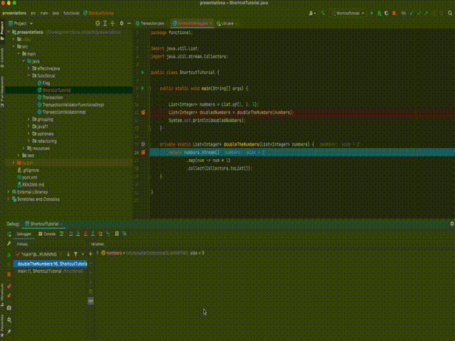

## Experimental code:
Lastly, there will be times where you want to test out a
small code sample without actually writing it in the codebase.
Some languages provide a Read, Evaluate, Print, Loop (REPL) that
allows you to type these expressions. Prior to Java 11, we did
not have that. IntelliJ provides tools to help us with this.

### Scratch files
```
CMD + Shift + N
```
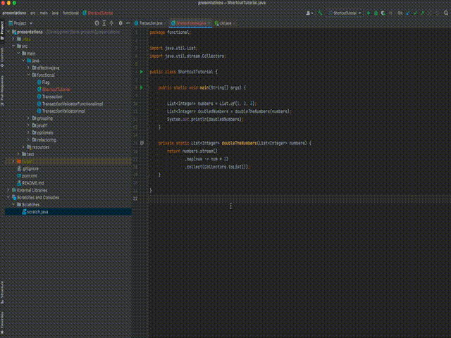

## Thanks
I want to thank [Andrew Thomas](https://github.com/ch00kz) for reviewing this document.

